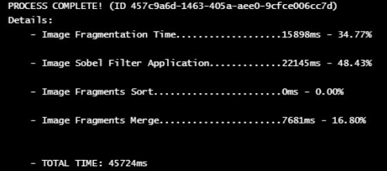

# Informe TP2 - Punto 4

## Tabla de contenidos
- [Punto A](#punto-a)
- [Punto B y C](#punto-b-y-c)
	- [Modulos](#módulos)
	- [Funcionamiento](#funcionamiento)
	- [Endpoints](#endpoints)
- [Analisis de performance](#analisis-de-performance)
	- [Explicación](#explicación)
- [Comparaciones](#comparaciones)
	- [1er comparación](#1er-comparacion)
	- [2da comparación](#2da-comparacion)
	- [3ra comparación](#3ra-comparacion)
	- [4ta comparación](#4ta-comparacion)

## Punto A
La APP centralizada es un servidor que realiza lo siguiente:

- Expone un endpoint para los usuarios y
- Aplica el filtro Sobel sobre la imagen.

Este endpoint recibe una imagen y devuelve la misma imagen pero con el filtro Sobel aplicado. Todo este proceso es realizado por el mismo servidor y en un mismo hilo. Se toma la imagen completa y se le aplica el filtro desde el primer pixel hasta el último.

## Punto B y C
El APP descentralizada es bastante mas completa, pero asigna determinadas responsabilidades en distintos modulos.

### Módulos:
Estos módulos son:
- El servidor principal: encargado de exponer los endpoints para los usuarios y fragmentar las imágenes recibidas de los clientes en imágenes mas pequeñas.
- El servicio RabbitMQ: encargado de entregarle las imágenes fragmentadas del servidor principal a los workers y de entregarle las imágenes fragmentadas ya procesadas (con el filtro Sobel aplicado) de los workers al warehouse. 
- Workers: Encargados de recibir imágenes fragmentadas, procesarlas aplicando 	el filtro Sobel y enviarlas nuevamente al Servicio RabbitMQ.
- Warehouse: Encargado de recibir las distintas imágenes fragmentadas y procesadas del servicio RabbitMQ, unir todos los fragmentos de una imagen (si los recibió) y guardarlo en la DB Redis.
- DB Redis: Encargado de almacenar toda información recibida por el Warehouse.

### Funcionamiento:
El Servidor Principal expone 2 endpoints (cuya información esta mas abajo). El primero es para que un usuario pueda “enviarle” una imagen al servidor. Este endpoint recibirá la imagen, y creará un proceso y le responderá al usuario el ID del mismo. De esta forma, el usuario puede usar este ID para llamar al segundo endpoint, el cual le responderá con la imagen ya procesada, o con el estado del proceso si es que la imagen no se terminó de procesar.

Una vez que el proceso es creado, la imagen es fragmentada en pedacitos mas pequeños, “envolviendo” cada fragmento en un mensaje. Cada mensaje tiene el ID del proceso, un ID del mensaje y la información de la imagen fragmentada. Esta información es importante para cuando los fragmentos tengan que ser unidos por el Warehouse.

Tendiendo el proceso y los mensajes, el servidor principal le “avisa” al Warehouse de dicho información a través del llamado de un endpoint.
Una vez avisado al Warehouse, el servidor principal envia cada uno de los mensajes a través del RabbitMQ a los Workers para ser procesado.
RabbitMQ sabe la cantidad de Workers escuchando y le asigna un mensaje a cada uno mediante Round Robbin. Por lo tanto, dependiendo la cantidad de Workers corriendo, puede que un Worker procese varios mensajes de un mismo proceso.

RabbitMQ espera un ACK del Worker:
- Un ACK positivo: en el caso que haya procesado la imagen correctamente
- o uno ACK negativo: en el caso que el worker haya crasheado,
- o ninguno: en el caso que el worker haya crasheado y no pueda responder.

Si RabbitMQ no recibe el ACK positivo, vuelve a encolar el mensaje, asignándole el mensaje a otro Worker.

Una vez que los Workers terminan de procesar un mensaje, lo envian a otra cola de RabbitMQ pero con el payload de la imagen fragmentada procesa y no la recibida inicialmente.

Del otro lado de esta cola, se encuentra el Warehouse consumiendo los mensajes procesados. Cada mensaje recibido por el Warehouse es almacenado en Redis. Como el Warehouse ya había sido “avisado” por el Servidor Principal, sabe perfectamente que mensaje le pertenece a cada proceso y en que orden unir los fragmentos.

Todo esto sucede luego de el primer endpoint es llamado. El segundo es usado para obtener la imagen procesada y, si no lo esta, devuelve un mensaje informado que el estado = ‘PENDING’. Este segundo endpoint, y tal como el primero, es expuesto por el Servidor Principal y para obtener la información del proceso, le consulta al Warehouse mediante endpoints tambien.

### Endpoints:
Insertar tabla aqui

## Analisis de Performance:
Si bien ambas APPs realizan los mismo, las dos funcionan de manera muy distinta.
La App centraliza es, como dice su nombre, centralizada y que tiene un solo modulo que realiza todo. Además hay que aclarar que todo se realiza de manera sincrónica.

Por otro lado tenemos la app centralizada que, como se describió antes, está dividida en varios módulos que realizan funciones distintas. Además cuenta con la característica que fragmenta las imágenes y tiene varios workers corriendo que las procesan simultáneamente. Si bien el asincronismo suena lindo en un comienzo, esto implica ciertas tareas que el proceso centralizado no cuentan. Entre ellas:
- El tiempo que toma fragmentar las imágenes.
- La distancia entre los servicios y los tiempos de la propagación de la información.
- El tiempo que toma ordenar y volver a unir todos los fragmentos en una sola foto.

### Explicación:
Para comparar los tiempos entre las 2 aplicaciones, se utilizará lo siguiente
- La herramienta Postman para la app centralizada. Siendo que la app centralizada expone un solo endpoint en donde recibe una imagen y devuelve la imagen procesada, podemos usar como medida de medición el tiempo de respuesta que Postman nos ofrece.
- Los Logs internos de la app distribuida. Siendo que la app distribuida es mas compleja, se desarrolló teniendo en cuenta el requisito de medir los tiempos. Estos logs muestran:
	- El tiempo que se tardó en fragmentar la imagen.
	- El tiempo que se tardó en aplicar el filtro sobel a todos los fragmentos.
	- El tiempo que se tardó en ordenar los mensajes recibidos.
	- El tiempo que se tardó en unir todos los mensajes.

Tambien, la app descentralizada tendrá 10 Workers corriendo en simultaneo.

## Comparaciones:
Se realizaran distintas pruebas con imágenes de distintos tamaños.
### 1er comparacion
- Nombre de la imagen: image1.jpg
- Dimensiones: 1920x1080px
- Tamaño: 712 KB

**Proceso centralizado:**

**Proceso descentralizado:**

### 2da comparacion
- Nombre de la imagen: image2.jpg
- Dimensiones: 2540x1693px
- Tamaño: 3,34 MB

**Proceso centralizado:**

**Proceso descentralizado:**

### 3ra comparacion
- Nombre de la imagen: image3.jpg
- Dimensiones: 5120x2880px
- Tamaño: 1.73 MB

**Proceso centralizado:**

**Proceso descentralizado:**

### 4ta comparacion
- Nombre de la imagen: image4.jpg
- Dimensiones: 8640x5760px
- Tamaño: 18.8 MB

**Proceso centralizado:**

Tiempo total: Ninguno. El servidor no pudo procesar una imagen tan grande.

**Proceso descentralizado:**

### Tabla de comparaciones

| imagen / tiempo | Servidor centralizado | Servidor Descentralizado |
|:-----------------|:-----------------------:|:--------------------------:|
|image1.jpg|1822 ms|3664 ms|
|image2.jpg|3440 ms|5566 ms|
|image3.jpg|8780 ms|11648 ms|
|image4.jpg| - |45724 ms|

### Conclusión:
Luego de las comparaciones, se puede observar que en todos los casos (a excepción de la ultima) el servidor descentralizado tardó mas en procesar la imagen. Analizando los logs podemos ver como la fragmentación de las imágenes tarda en promedio 40% aproximadamente de todo el proceso. Es un numero considerablemente alto siendo que, por ejemplo, la union de los fragmentos toma el 13% aproximadamente.

Por otro lado, no está de mas mencionar que, en el caso que existan mayor cantidad de mensajes encolados que workers procesando, el tiempo que tardaría en completar los procesos seria mucho mayor. Esto es por que los workers solo puede procesar una solo mensaje a la vez debido a la implementacion de mensajes ACK.

A pesar de que la app descentralizada tenga una peor performance en cuestiones de tiempo, hay que destacar que esta app puede soportar imágenes mas pesadas. Esto lo podemos ver en la 4ta comparacion, en donde la imagen no pudo ser soportada por la app centralizada.

## Imagenes y resultados

